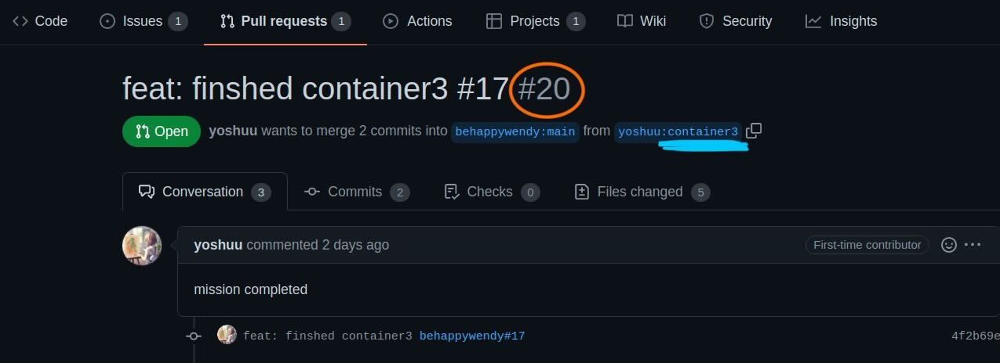

## 情境描述

協作者/貢獻者發來 PR，在 merge 到專案之前，想先從本地的編輯器來看 code 或畫面(live server)。

## 指令

1. `git fetch origin pull/ID/head:BRANCHNAME` :在本地 repo fetch
2. `git checkout BRANCHNAME` :切換到 fetch 下來的分支

- ID: pull request ID number (見下圖橘色部份)
- BRANCHNAME: PR 來源分支名稱 (見下圖藍色底線)

範例：
以圖片的 PR 為例，要看到 PR 內容，應輸入指令為：

`git fetch origin pull/20/head:container3`

`git checkout container3`

### [官方 Doc 指引](https://docs.github.com/en/pull-requests/collaborating-with-pull-requests/reviewing-changes-in-pull-requests/checking-out-pull-requests-locally#modifying-an-inactive-pull-request-locally)
